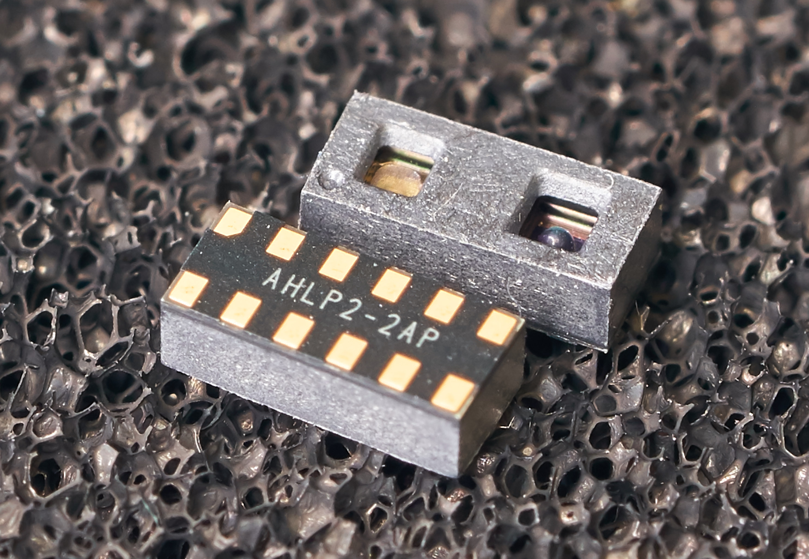
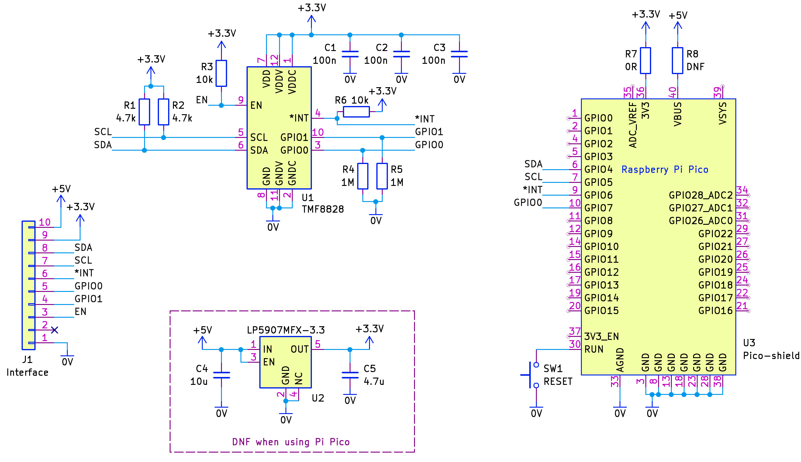
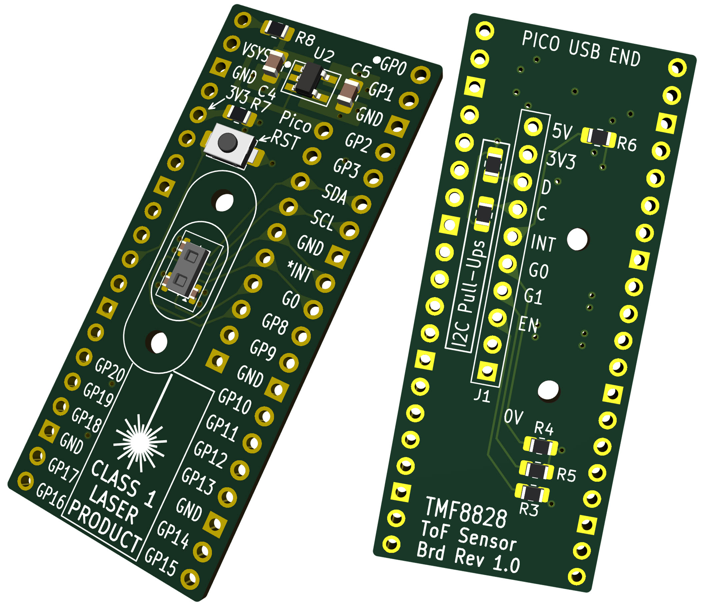

# TMF8828 Multi-Zone Time-of-Flight Sensor

# Introduction
This repository contains a project (hardware and software) related to the TMF8828 sensor. 

[Click here for information regarding the TMF8828](https://community.element14.com/products/manufacturers/ams_osram/b/blog/posts/engineer-to-engineer-understanding-time-of-flight-sensing).

**Caution**
 The device contains a laser. In the photo above, the aperture on the left (lighter color) contains the laser. The darker aperture on the right contains the sensor array.

# Circuit Diagram
The circuit shown below can be assembled onto a small board. It is designed to either interface with a Pi Pico board, or, alternatively, any other microcontroller with a 3.3V I2C interface. 

Some components are labeled DNF (Do Not Fit), depending on if you intend to use the board with a Pi Pico or with a different board.

# PCB Layout
The KiCad files (requires KiCad V8.0 upward) are in the repo, as well as the generated Gerber files, ready for sending to a PCB factory. 

Currently, there are no known errors, but it has not undergone much testing beyond basic board bring-up, and running some code that appears to provide a response from the sensor.

# Source Code
The tmf8828_experiment_board folder contains a Pi Pico project (requires the [Pi Pico C/C++ SDK](https://www.raspberrypi.com/documentation/microcontrollers/c_sdk.html)). 

After building the code (follow the Pi Pico C/C++ SDK user instructions), hold down the BOOTSEL button on the Pi Pico, plug in the USB cable into the PC, release the BOOTSEL button, and then drag across the built .uf2 file onto the USB drive letter that appeared. The firmware will be uploaded into the Pi Pico, and it will automatically start running the code. 

The device will present a serial port, which can be opened using an serial console software, at 115200 baud, to see a stream of data in text form. 

The source code is based on the Unified Arduino driver for TMF8820/24/28 available under the **Software** section at the [AMS TMF8828 web page](https://ams-osram.com/products/sensors/direct-time-of-flight-sensors-dtof/ams-tmf8828-configurable-8x8-multi-zone-time-of-flight-sensor), and a modification of it from https://github.com/Zalmotek/renesas-ams-osram-pmod1/tree/main/firmware/C/TMF8828  
